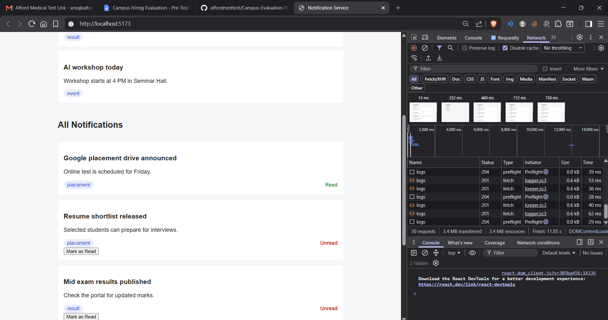
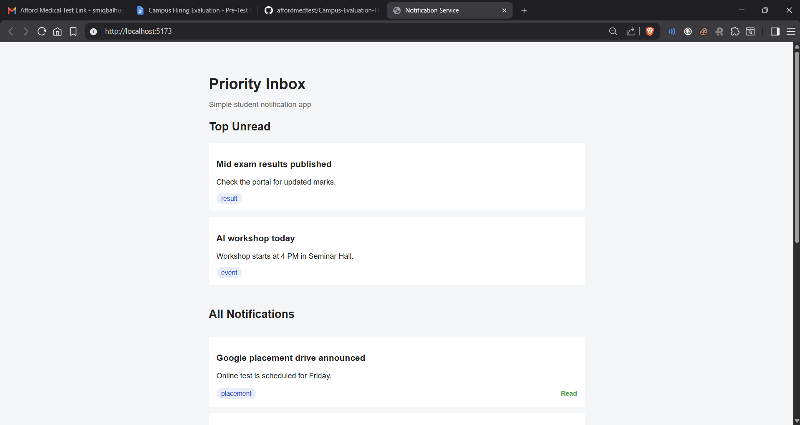
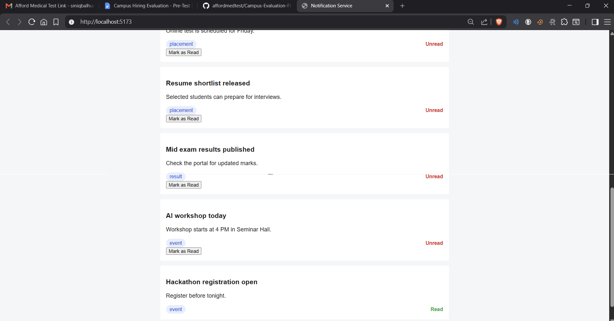
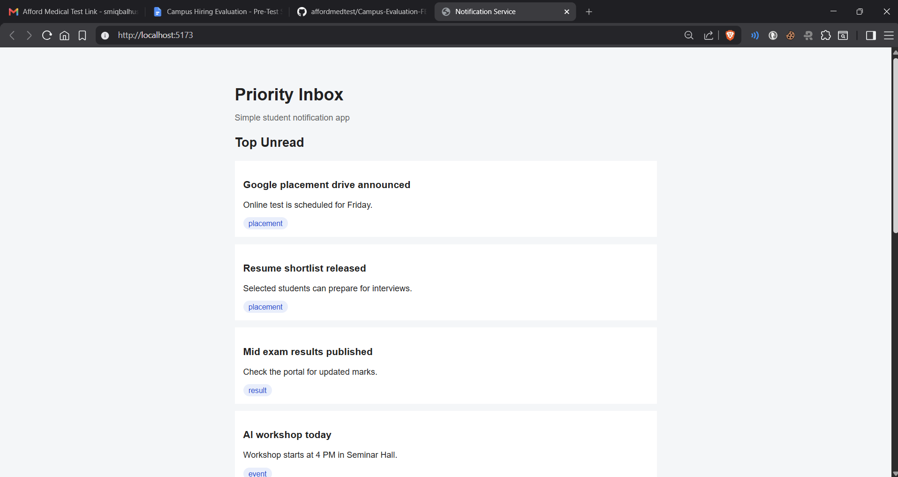

# Notification System Design

I made a simple notification app for this task. The main idea is to show all notifications and also show priority notifications separately.

Priority notifications are sorted based on type and time. Placement notifications get higher priority than Result, and Result gets higher priority than Event. If two notifications have the same type, the latest one comes first.

The app uses the given notifications API to fetch data, and I did not hardcode notifications. I also added the logging middleware in important places like page load, API call, filter change, and mark as read action.

Overall, I tried to keep the project simple, readable, and easy to understand while following the given requirements.

